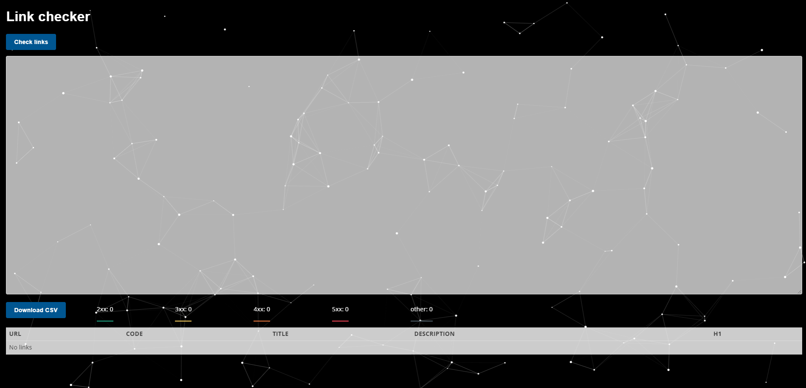
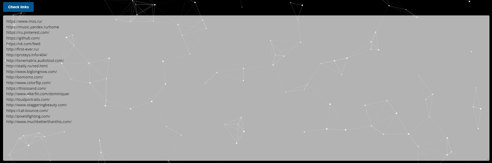
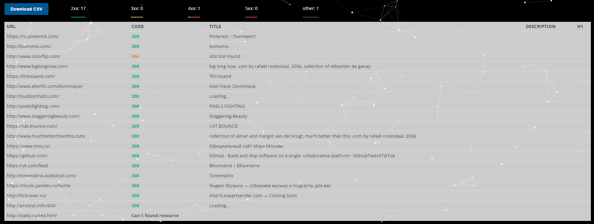
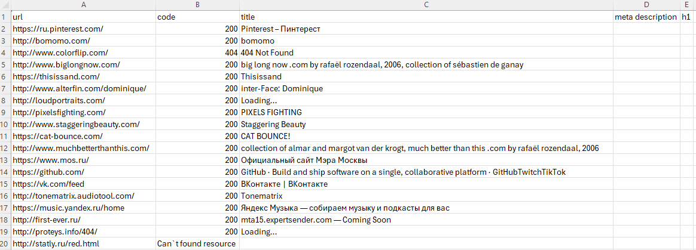

# Link checker

Сайт развернут на GitLab, с его работой можно ознакомиться по ссылке:
https://figvam-vol-template.figvam.ru/

## Для чего был создан проект

Данный проект предназначен для помощи SEO-разработчикам в проверке валидности URL-адресов.
Поссле ввода ссылок в текстовое поле сайт выдает результат с кодом ответа по каждому URL-адресу,
таблицу с результатами можно скачать в CSV-формате для дальнейшего анализа.

## Примеры работы проекта

- Внешний вид

- Поле ввода

- Таблица с результатами

- Таблица Excel
